# "Thingsboard Widget Library" Documentation

## Table of Contents 
1. [General](#general)  
   1.1 [Requirements](#requirements)  
   1.2 [Installation](#installation)  
2. [Control Widgets](#controlwidgets)  
	2.1 [Switch 1](#switch1)  
	2.2 [Toggle Button 1](#togglebutton1)  
	2.3 [Slider](#slider)  
	2.4 [Thermostat 1](#thermostat1)  
	2.5 [Thermostat 2](#thermostat2)  
	2.6 [Round Slider 1](#roundslider1)  
    2.7 [Multi Slider 1](#multislider1)  
    2.8 [Switch 2](#switch2)  
3. [Latest Value Widgets](#latestvaluewidgets)  
   3.1 [Fluid Level 1](#fluidlevel1)  
   3.2 [Fluid Level 2](#fluidlevel2)  
   3.3 [Light Bulb 1](#lightbulb1)  
   3.4 [Gauge 1](#gauge1)  
   3.5 [Gauge 2](#gauge2)  
   3.6 [Gauge 3](#gauge3)  
4. [Static Widgets](#staticwidgets)  
  4.1 [Change Dashboard State 1](#changedashboardstate1)  
5. [Timeseries](#timeseries)  
  5.1 [Chart 1](#chart1) 

## 1. General

### 1.1 Requirements

The widget library requires Thingsboard version greater than 3.0. This can be used for Thingsboard CE, Thinsgsboard PE or Thingsboard.cloud.

### 1.2 Installation

To install a widget from the Widget library, please login to your Thingsboard installation, or your Thingsboard.cloud account. Then open the Widget Library and add a new widget Bundle. 

Select "Import Widget Type" and choose the JSON File from the Git Repository and select "Import"

 
  
 

## 2. Control Widgets

### 2.1 Switch 1

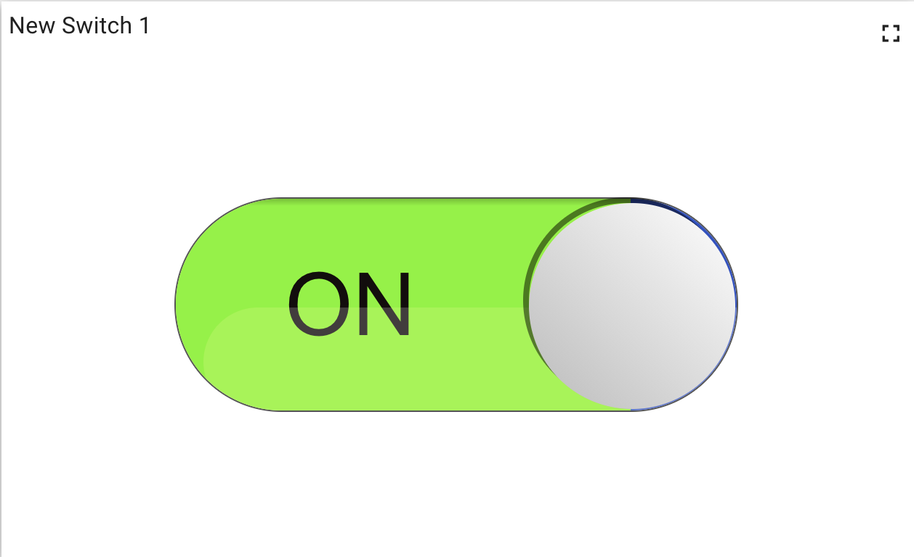
 

### 2.2 Toggle Button 1

 

### 2.3 Slider

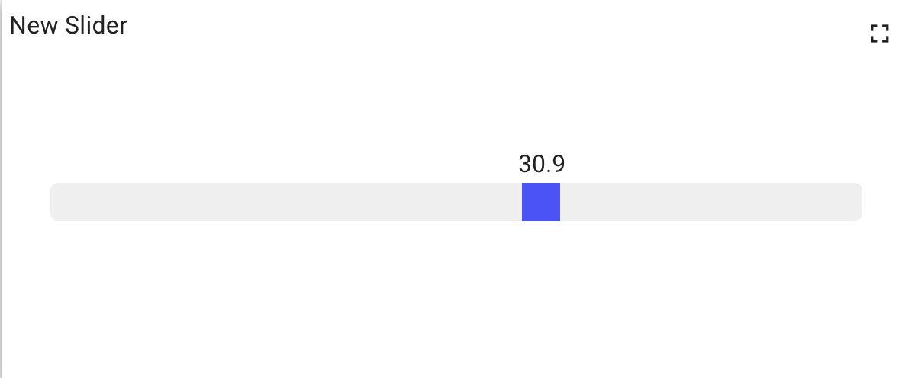 

### 2.4 Thermostat 1

Widget type: Control Widget

The Thermostat Wiget allows the graphical adjustment of a value using the two arrow keys. The values will be syncronized with the device at startup and sends the current values on change. The min and max as well as the Step-width can be adjusted.

### Parameters:

**Change request Method**

SetValue RPC Method - Default: setValue

**RPC request timeout**

Max. Response time for a RPC request. - Default: 500ms

**Status request Method**

Get Value RPC Method - Default: getValue

**Minimum Value**

Min. Value - Default: 0
   
**Maximum Value**

Max. Value - Default: 100   

**Step Width**

Step Width, can be 0.1 or 1 - Default: 1   
   

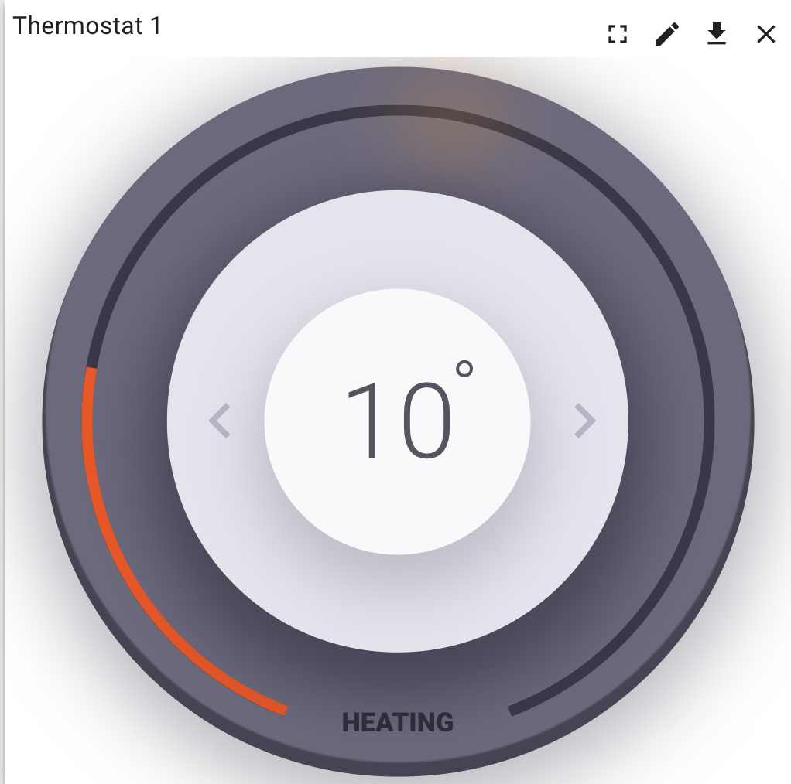

### 2.5 Thermostat 2

Widget type: Control Widget

The Thermostat Wiget allows the graphical adjustment of a value using the two arrow keys. The values will be syncronized with the device at startup and sends the current values on change. The min and max as well as the Step-width can be adjusted.

### Parameters:

**Change request Method**

SetValue RPC Method - Default: setValue

**RPC request timeout**

Max. Response time for a RPC request. - Default: 500ms

**Status request Method**

Get Value RPC Method - Default: getValue

**Minimum Value**

Min. Value - Default: 0
   
**Maximum Value**

Max. Value - Default: 100   

**Step Width**

Step Width, can be 0.1 or 1 - Default: 1   
   

### 2.6 Round Slider

### 2.7 Multi Slider

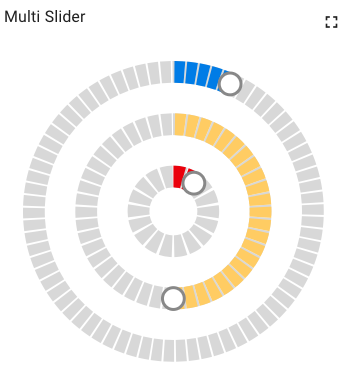

### 2.8 Switch 2

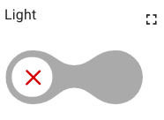
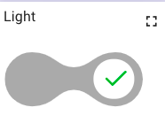 

## 3. Latest Value Widgets

### 3.1 Fluid Level 1

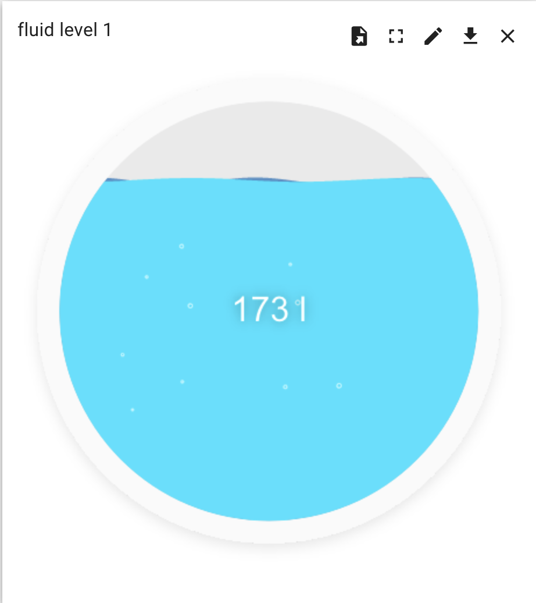  

### 3.2 Fluid Level 2

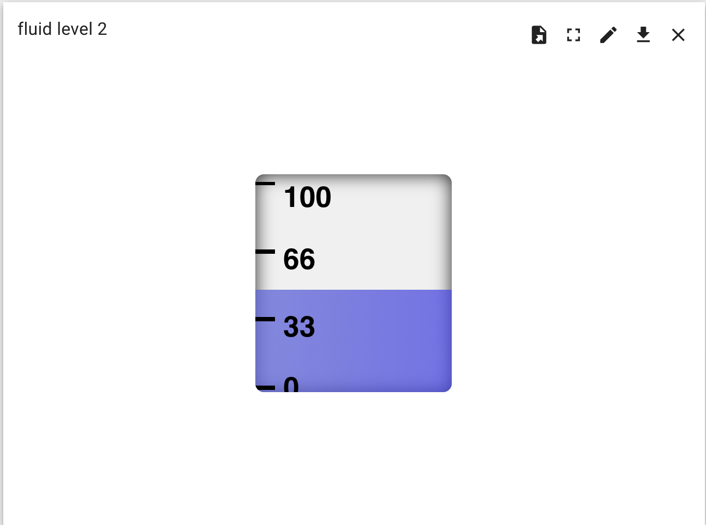  

### 3.3 Light Bulb 1

  

### 3.4 Gauge 1

  
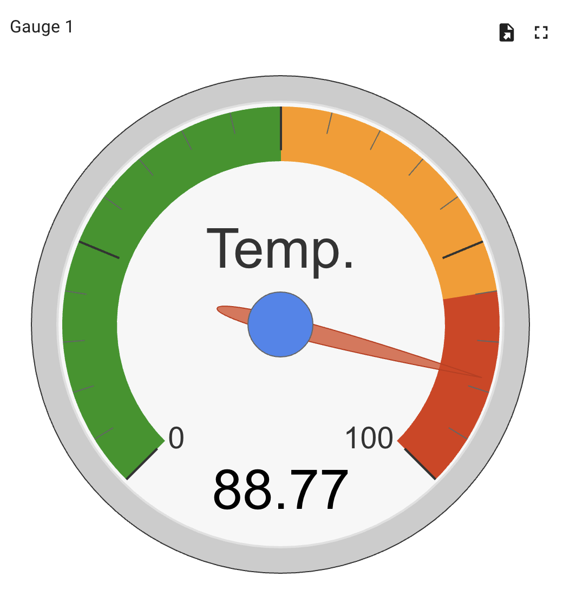  

### 3.5 Gauge 2

  

### 3.6 Gauge 3

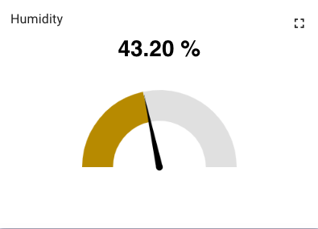  

Gauge based on Gauge.js

### Parameters:

**Maximum Value**

Maximum Gauge value - Default: 100

**Minimum Value**

Minimum Gauge value - Default: 0

**Unit**

Unit added to the value - Default: °C

**Width**

Line thickness - Default: 0.4

**Min. Color**

Color for Min. Value

**Max. Color**

Color for Max. Value

**Angle**

The span of the gauge arc

## 4. Static Widgets

### 4.1 Change Dashboard State 1

  

## 5. Timeseries

### 5.1 Chart 1  

Clean Chart with nice XY-zoom. The zoom can be selected by holding and dragging the left mouse button and reset with the right mouse button.

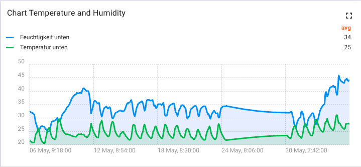  